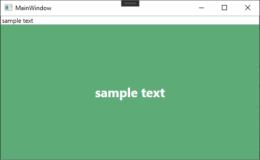
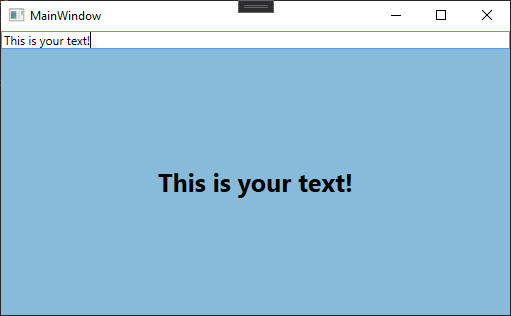

# TextToColor Generator

Converts any text to a specific color representation. Depending of the background color the foreground color will be automatically switched between light (white) and dark (black).

## Examples

Example with light foreground color:

Example with dark foreground color:

